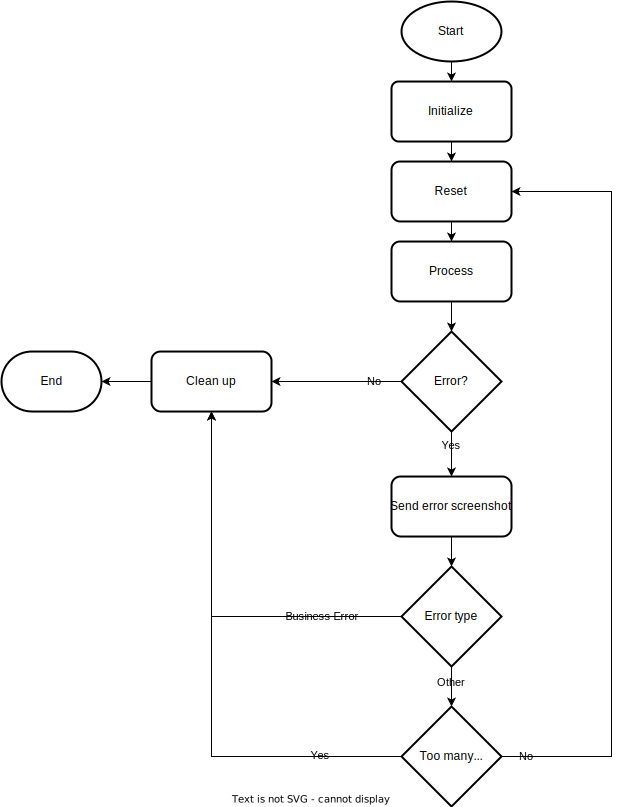

# README for Vejman Fakturering Robot

## Overview

This project contains a robot process designed to automate the daily handling of invoice lines fetched from Vejman. The robot ensures that unprocessed invoice lines are added or updated in a SQL database and notifies the caseworker in case of discrepancies in the invoice lines.

---

## Features

1. **Token Retrieval:**

   - Logs into Vejman using provided credentials.
   - Retrieves an authentication token required for API requests.

2. **Data Fetching:**

   - Retrieves pricebook data to map unit prices.
   - Fetches permissions data for specific equipment types within a given date range.

3. **Invoice Processing:**

   - Processes invoice lines retrieved from Vejman.
   - Checks and cleans authority reference numbers.
   - Filters and validates invoice lines for specific conditions.

4. **Database Operations:**

   - Adds or updates invoice lines in the SQL database (`[dbo].[VejmanFakturering]` table).
   - Uses SQL `MERGE` queries for efficient data management.

5. **Email Notifications:**

   - Sends email notifications to caseworkers if discrepancies are detected in the invoice lines.
   - Provides detailed guidance on required corrections.

---

## Requirements

### Libraries and Modules

- **Python Standard Libraries:** `random`, `re`, `time`, `string`, `datetime`
- **Third-Party Libraries:**
  - `pyodbc` for SQL Server connectivity
  - `requests` for API communication
  - `selenium` for browser automation
  - `pandas` for data manipulation
  - `smtplib` and `email.message` for sending email notifications

### External Tools

- **Selenium WebDriver**: Uses selenium, make sure you have a valid install of chrome or chromium on the machine.
- **SQL Server**: The robot interacts with the `[dbo].[VejmanFakturering]` and `[dbo].[VejmanFakturaTekster]` tables.

### Configuration

- **Orchestrator Connection**: Used to fetch credentials and constants like database server information.
- **SMTP Settings**: Configure `config.SMTP_SERVER` and `config.SMTP_PORT` for email sending.

---

## Usage

### Main Process

The main function, `process`, handles the workflow:

1. **Setup:**

   - Logs the start of the process.
   - Retrieves necessary credentials and configuration from the orchestrator.

2. **Data Fetching:**

   - Fetches invoice data and permissions from Vejman.
   - Cleans and validates data.

3. **Database Interaction:**

   - Checks existing data in the SQL database.
   - Adds or updates invoice lines using `MERGE` SQL queries.

4. **Email Notifications:**

   - Sends notifications to caseworkers for detected discrepancies.

### Helper Functions

- **`FetchVejmanToken`**: Logs into Vejman and retrieves an authentication token.
- **`FetchVejmanPermissions`**: Fetches permissions data for a specific equipment type and date range.
- **`FetchPricebookData`**: Retrieves pricebook data to get correct unit_price.
- **`FetchInvoice`**: Processes invoice lines, checks for discrepancies, and updates the database.
- **`SendEmail`**: Sends HTML emails to caseworkers and developers.

---

## Error Handling

- **Login Errors:** If the login to Vejman fails, ensure that credentials are correct and Vejman is operational.
- **Database Connectivity:** Ensure the SQL Server connection string is correctly configured.
- **Discrepancy Handling:** Discrepancies in invoice lines are logged and emailed to the responsible caseworker.

---

## Notes

- The robot fetches new invoice lines daily and processes them automatically.
- All detected discrepancies are emailed once per invoice line to avoid spam.
- Ensure that all configurations and credentials are up-to-date for uninterrupted operation.

---

# Robot-Framework V3

This repo is meant to be used as a template for robots made for [OpenOrchestrator](https://github.com/itk-dev-rpa/OpenOrchestrator).

## Quick start

1. To use this template simply use this repo as a template (see [Creating a repository from a template](https://docs.github.com/en/repositories/creating-and-managing-repositories/creating-a-repository-from-a-template)).
__Don't__ include all branches.

2. Go to `robot_framework/__main__.py` and choose between the linear framework or queue based framework.

3. Implement all functions in the files:
    * `robot_framework/initialize.py`
    * `robot_framework/reset.py`
    * `robot_framework/process.py`

4. Change `config.py` to your needs.

5. Fill out the dependencies in the `pyproject.toml` file with all packages needed by the robot.

6. Feel free to add more files as needed. Remember that any additional python files must
be located in the folder `robot_framework` or a subfolder of it.

When the robot is run from OpenOrchestrator the `main.py` file is run which results
in the following:
1. The working directory is changed to where `main.py` is located.
2. A virtual environment is automatically setup with the required packages.
3. The framework is called passing on all arguments needed by [OpenOrchestrator](https://github.com/itk-dev-rpa/OpenOrchestrator).

## Requirements
Minimum python version 3.10

## Flow

This framework contains two different flows: A linear and a queue based.
You should only ever use one at a time. You choose which one by going into `robot_framework/__main__.py`
and uncommenting the framework you want. They are both disabled by default and an error will be
raised to remind you if you don't choose.

### Linear Flow

The linear framework is used when a robot is just going from A to Z without fetching jobs from an
OpenOrchestrator queue.
The flow of the linear framework is sketched up in the following illustration:

### Queue Flow

The queue framework is used when the robot is doing multiple bite-sized tasks defined in an
OpenOrchestrator queue.
The flow of the queue framework is sketched up in the following illustration:

## Linting and Github Actions

This template is also setup with flake8 and pylint linting in Github Actions.
This workflow will trigger whenever you push your code to Github.
The workflow is defined under `.github/workflows/Linting.yml`.

